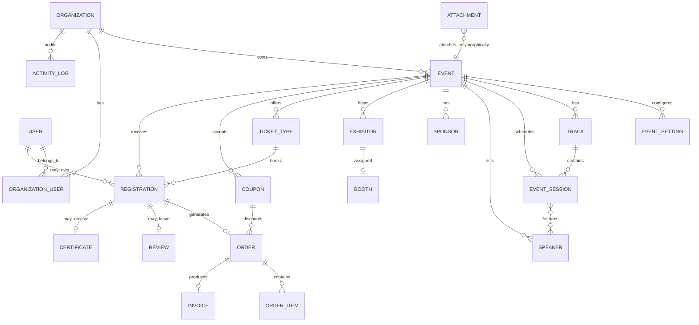

# DATABASE_GUIDELINES.md

## Naming Conventions

- Tables: `snake_case`, plural (`events`, `ticket_types`, `order_items`).
- Models: `PascalCase`, singular (`Event`, `TicketType`, `OrderItem`).
- Foreign keys: `{singular_table}_id` (`organization_id`, `event_id`).
- Pivot tables: alphabetical singular pair (`organization_user`), or a
  named pivot model where the pivot carries data (`EventSessionSpeaker`
  with a `role` column, e.g. "keynote").
- Booleans: `is_` / `has_` prefix (`is_published`, `has_capacity_limit`).
- Timestamps beyond the default pair: explicit and typed
  (`published_at`, `checked_in_at`, `expires_at`).
- **Note:** the agenda `Session` model maps to `event_sessions` because
  Laravel reserves `sessions` for HTTP session storage.

## Every Migration Must

- Define an explicit index and `onDelete` behavior on every foreign key.
  Cascade for owned children (e.g. `Order` → `OrderItem`), restrict/null
  for shared references (e.g. deleting a `TicketType` shouldn't cascade-
  delete historical `OrderItem` rows) — state which you chose in a
  migration comment.
- Index every tenant-owned table on `organization_id`, plus a composite
  index on `(organization_id, <hot-path column>)` where there's an
  obvious filter pattern, e.g. `(organization_id, status)` on `events`.
- Cast every JSON, date, decimal, and enum column via `$casts` on the
  model — never leave a JSON column as a raw string in application code.

## Soft Deletes

Applied where "undo" or audit history matters: `Event`, `Order`,
`Registration`, `Organization`, `User`. Not applied blindly to lookup/
config tables (`EventSetting`, pivot tables) where there's no undo value.

## JSON Column Shapes

Document the expected shape directly above the migration column
definition. Shapes in active use:

```php
// events.theme_config: { primary_color, secondary_color, font, logo_url,
//                       hero_image_url, layout_variant }
// events.landing_page_config: { blocks: [{ type: 'hero'|'about'|
//                       'agenda-preview'|'speakers-preview'|'sponsors'|
//                       'faq'|'cta', settings: {} }] }
// speakers.social_links: { twitter, linkedin, website, github }
// registrations.custom_fields: { company, job_title, dietary_requirements, ... }
// certificates.template_config: { title, subtitle, signature_name, background_url }
// activity_logs.metadata: { ip, user_agent, changes, ... }
// event_settings.value: arbitrary JSON validated per key in later phases
```

Malformed payloads are rejected server-side via a custom validation Rule
class before they ever hit the column — the frontend builder's shape and
the backend's validated shape must never drift.

## Multi-Tenancy At The Schema Level

Every tenant-owned table carries `organization_id`. The `BelongsToTenant`
trait (see `TENANCY.md`) handles scoping automatically — this file only
covers the schema/indexing side of that contract.

## Core ER Overview



## Tenant-Scoped Tables (Phase 3)

All models below use `BelongsToTenant`:

| Table | Model | Soft deletes |
|---|---|---|
| `events` | `Event` | yes |
| `event_settings` | `EventSetting` | no |
| `tracks` | `Track` | no |
| `event_sessions` | `EventSession` | no |
| `speakers` | `Speaker` | no |
| `sponsors` | `Sponsor` | no |
| `exhibitors` | `Exhibitor` | no |
| `booths` | `Booth` | no |
| `ticket_types` | `TicketType` | no |
| `coupons` | `Coupon` | no |
| `registrations` | `Registration` | yes |
| `orders` | `Order` | yes |
| `order_items` | `OrderItem` | no |
| `invoices` | `Invoice` | no |
| `reviews` | `Review` | no |
| `certificates` | `Certificate` | no |
| `activity_logs` | `ActivityLog` | no |
| `attachments` | `Attachment` | no |

**Not tenant-scoped:** `users`, `organizations`, `notifications`,
`jobs`, `failed_jobs`, `event_session_speaker` (pivot), `tenant_fixtures`
(Phase 2 test fixture).

## Seeding

`DatabaseSeeder` calls `PermissionSeeder` then `PlatformDataSeeder`:

- 3 organizations with owner + admin + 3 members each
- 4 events per org (draft, published ×2, archived)
- Flagship published event per org: tracks, sessions, speakers, sponsors,
  exhibitors/booths, paid + free ticket types
- 25 registrations + paid orders + invoices on each flagship event

Run: `php artisan migrate:fresh --seed`

## onDelete Summary

| Relationship | onDelete | Rationale |
|---|---|---|
| `organization_id` on tenant tables | cascade | Child rows belong to org |
| `event_id` on event children | cascade | Owned by event |
| `user_id` on registrations/orders | null | Preserve history if user deleted |
| `ticket_type_id` on registrations/items | restrict | Preserve commerce audit trail |
| `registration_id` on order_items | restrict | Preserve line-item history |
| `track_id` on event_sessions | null | Keep session if track removed |
| `coupon_id` on orders | null | Order survives coupon removal |
